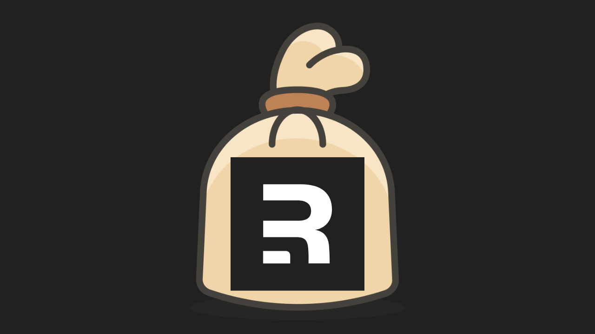

# remix-cache


 
 



remix-cache is a powerful and lightweight library made for Remix.run to cache your server loader data on the client using clientLoaders.

By default it uses the stale while revalidate strategy and hot swaps your stale info once loaded from the server. It also allows you to invalidate the cache for a specific key or multiple keys.

It allows you to pass in an adapter of your choice to cache your data. 

It comes with a default adapter that uses in memory storage to cache your data.

First party support for localStorage, sessionStorage and localforage packages. You can just provide them as the argument to `configureGlobalCache`.

## Install

    npm install remix-cache

## Basic usage

Here is an example usage of remix-cache with the default in memory adapter.

```tsx
import { json, type LoaderFunctionArgs } from "@remix-run/node";
import { ClientLoaderFunctionArgs } from "@remix-run/react";

import { cacheClientLoader, useCachedLoaderData } from "remix-cache";

export const loader = async ({ params }: LoaderFunctionArgs) => {
  const response = await fetch(
    `https://jsonplaceholder.typicode.com/users/${params.user}`
  );
  const user = await response.json();
  await new Promise((resolve) => setTimeout(resolve, 1000));
  return json({ user: { ...user, description: Math.random() } });
};


// Caches the loader data on the client
export const clientLoader = (args: ClientLoaderFunctionArgs) => cacheClientLoader(args);
  
// make sure you turn this flag on
clientLoader.hydrate = true;

export default function Index() {
  // The data is automatically cached for you and hot swapped when refetched
  const { user } = useCachedLoaderData<typeof loader>(); 

  return (
    <div>
      {user.name} <hr /> {user.email}
      <hr />
      {user.username}
      <hr />
      {user.website} <hr />
      {user.description} 
    </div>
  );
}

```

## Cache adapters

The library exports an interface you need to implement in order to create your own cache adapter. The interface is called `CacheAdapter`.
It closely matches the interface of `Storage` and requires you to have the following methods:

- `getItem`: takes a key and returns a promise that resolves to the value stored at that key
- `setItem`: takes a key and a value and returns a promise that resolves when the value is stored
- `removeItem`: takes a key and returns a promise that resolves when the value is removed

The `cacheLoaderData` will use the default memory cache adapter that comes with the library. If you want an advanced use-case make sure that the adapter you provide implements the `CacheAdapter` interface.

```ts
// Inside your entry.client.tsx file 
import { RemixBrowser } from "@remix-run/react";
import { startTransition, StrictMode } from "react";
import { hydrateRoot } from "react-dom/client";

import { configureGlobalCache } from "remix-cache";

// You can use the configureGlobalCache function to override the libraries default in-memory cache adapter
configureGlobalCache(() => localStorage); // uses localStorage as the cache adapter

startTransition(() => {
  hydrateRoot(
    document,
    <StrictMode>
      <RemixBrowser />
    </StrictMode>
  );
});

```

You can use the `configureGlobalCache` function to override the libraries default in-memory cache adapter. It will globally switch to whatever adapter you provide to it.

If you want to have a per route adapter you can use the `createCacheAdapter` to create an adapter and provide it to your hooks and functions.

```ts

import { createCacheAdapter, useCachedLoaderData } from "remix-cache";

const { adapter } = createCacheAdapter(() => localStorage); // uses localStorage as the cache adapter


// Caches the loader data on the client
export const clientLoader = (args: ClientLoaderFunctionArgs) => cacheClientLoader(args, { 
  // We pass our custom adapter to the clientLoader
  adapter
});
  
// make sure you turn this flag on
clientLoader.hydrate = true;

export default function Index() {
  const { user } = useCachedLoaderData<typeof loader>({ 
    // We use the adapter returned by the createCacheAdapter function
    adapter
  });

  return (
    <div>
      {user.name} <hr /> {user.email}
      <hr />
      {user.username}
      <hr />
      {user.website} <hr />
      {user.description} 
    </div>
  );
}


```

Here are some examples of how you can use the library with different global adapters.

```ts
configureGlobalCache(() => localStorage); // uses localStorage as the cache adapter
configureGlobalCache(() => sessionStorage); // uses sessionStorage as the cache adapter
configureGlobalCache(() => localforage); // uses localforage as the cache adapter
```

Also with different per route adapters:

```ts
const { adapter } = createCacheAdapter(() => localStorage); // uses localStorage as the cache adapter
const { adapter } = createCacheAdapter(() => sessionStorage); // uses sessionStorage as the cache adapter
const { adapter } = createCacheAdapter(() => localforage); // uses localforage as the cache adapter
```

Let's say you want to use a custom adapter that uses a database to store the data. 

You can do that by implementing the `CacheAdapter` interface and passing it to the `configureGlobalCache` or `createCacheAdapter` function.

```ts
class DatabaseAdapter implements CacheAdapter {
  async getItem(key: string) {
    // get the item from the database
  }

  async setItem(key: string, value: string) {
    // set the item in the database
  }

  async removeItem(key: string) {
    // remove the item from the database
  }
}

configureGlobalCache(() => new DatabaseAdapter()); // uses your custom adapter as the cache adapter globally
const { adapter } = createCacheAdapter(() => new DatabaseAdapter()); // uses your custom adapter as the cache adapter per route
```
 

## API's

### createCacheAdapter

Function that creates a cache adapter and returns it. It takes one argument, the `adapter` that is used to store the data. 

```ts
import { createCacheAdapter } from "remix-cache";

const { adapter } = createCacheAdapter(() => localStorage); // uses localStorage as the cache adapter
```

### configureGlobalCache

Function that configures the global cache adapter. It takes one argument, the `adapter` that is used to store the data. 

```ts
import { configureGlobalCache } from "remix-cache";

configureGlobalCache(() => localStorage); // uses localStorage as the cache adapter
```


### cacheClientLoader

Used to cache the data that is piped from the loader to your component using the `clientLoader` export. 

It takes two arguments, the first one is the `ClientLoaderFunctionArgs` object that is passed to the `clientLoader` function, the second one is an object with the following properties:

- `type` - that tells the client loader if it should use the normal caching mechanism where it stores the data and early returns that instead of refetching or if it should use the `staleWhileRevalidate` mechanism where it returns the cached data and refetches in the background. 
- `key` - key that is used to store the data in the cache. Defaults to the current route path including search params and hashes. (eg. /user/1?name=John#profile)
- `adapter` - the cache adapter that is used to store the data. Defaults to the in memory adapter that comes with the library.
 

```tsx
import { json, type LoaderFunctionArgs } from "@remix-run/node";
import { ClientLoaderFunctionArgs } from "@remix-run/react"; 
import { cacheClientLoader, useCachedLoaderData } from "remix-cache";

export const loader = async ({ params }: LoaderFunctionArgs) => {
  const response = await fetch(
    `https://jsonplaceholder.typicode.com/users/${params.user}`
  );
  const user = await response.json();
  await new Promise((resolve) => setTimeout(resolve, 1000));
  return json({ user: { ...user, description: Math.random() } });
};

export const clientLoader = (args: ClientLoaderFunctionArgs) => cacheClientLoader(args, {
  type: "swr", // default is swr, can also be set to normal
  key: "/user/1" // default is the current route path including search params and hashes
  adapter: () => localStorage // default is the in memory adapter, can be anything your wish
});
clientLoader.hydrate = true;

```


### useCachedLoaderData

Hook that can be used to get the cached data from the `clientLoader` export. Must be used together with `cacheClientLoader`  because the data returned from
the `cacheClientLoader` is augmented to work with `useCachedLoaderData` in mind and not the standard `useLoaderData` hook.

```tsx
import { useCachedLoaderData } from "remix-cache";

// Must be used together with cacheClientLoader
export const clientLoader = (args: ClientLoaderFunctionArgs) => cacheClientLoader(args, "swr");
clientLoader.hydrate = true;

export default function Index() {
  // The data is automatically cached for you and hot swapped when refetched
  const { user } = useCachedLoaderData<typeof loader>(); 

  return (
    <div>
      {user.name} <hr /> {user.email}
      <hr />
      {user.username}
      <hr />
      {user.website} <hr />
      {user.description} 
    </div>
  );
}
```

Accepts an optional object with the following properties:
- `adapter` - the cache adapter that is used to store the data. Defaults to the in memory adapter that comes with the library.
 
 ### invalidateCache

Utility function that can be used to invalidate the cache for a specific key. It takes one argument, the `key` that is used to store the data in the cache. 
Can also be an array of keys

```ts
import { invalidateCache } from "remix-cache";

invalidateCache("/user/1"); // invalidates the cache for the /user/1 route
```

Keep in mind this can only be used on the client, so either in `clientLoader` or `clientAction` exports or the components themselves.

### useCacheInvalidator

Hook that returns a function that can be used to invalidate the cache for a specific key. It takes one argument, the `key` that is used to store the data in the cache. Can also be an array of keys

```tsx
import { useCacheInvalidator } from "remix-cache";

export default function Index() {
  const { invalidateCache } = useCacheInvalidator(); 

  return (
    <div>
      // invalidates the cache for the /user/1 route
      <button onClick={ () => invalidateCache("/user/1") }>Invalidate cache</button>
    </div>
  );
}
``` 

## Support 

If you like the project, please consider supporting us by giving a ⭐️ on Github.


## License

MIT

## Bugs

If you find a bug, please file an issue on [our issue tracker on GitHub](https://github.com/Code-Forge-Net/remix-cache/issues)


## Contributing

Thank you for considering contributing to remix-cache! We welcome any contributions, big or small, including bug reports, feature requests, documentation improvements, or code changes.

To get started, please fork this repository and make your changes in a new branch. Once you're ready to submit your changes, please open a pull request with a clear description of your changes and any related issues or pull requests.

Please note that all contributions are subject to our [Code of Conduct](https://github.com/Code-Forge-Net/remix-cache/blob/main/CODE_OF_CONDUCT.md). By participating, you are expected to uphold this code.

We appreciate your time and effort in contributing to remix-cache and helping to make it a better tool for the community!

